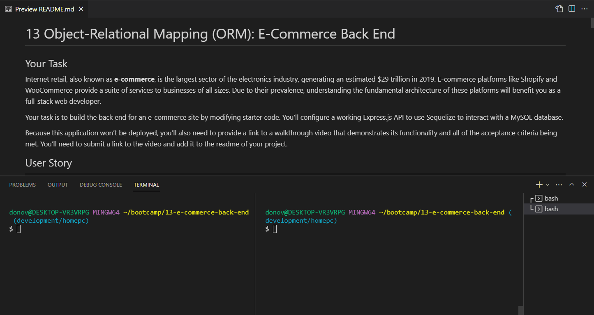
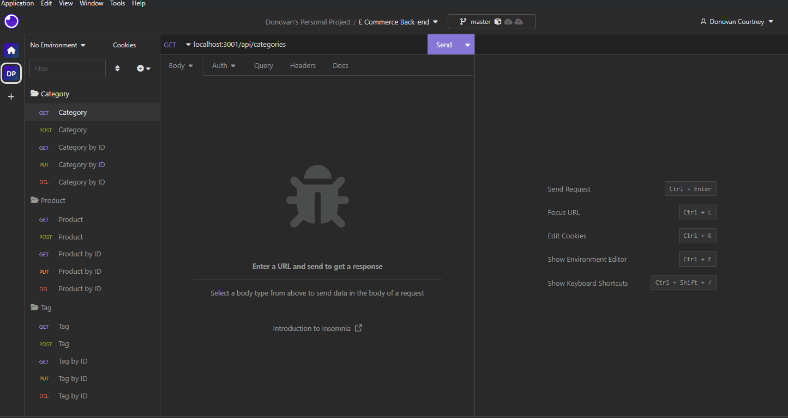
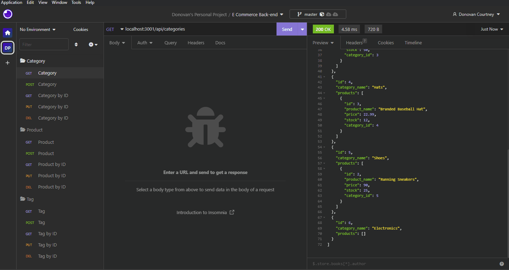
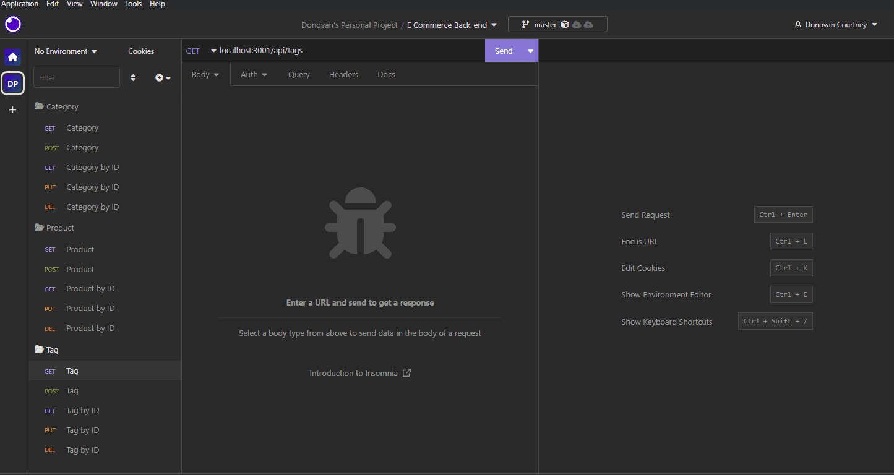

# Sequelized E-Commerce Back-End

  
## Table of Contents

* [Description](#description)
* [Installation](#installation)
* [Usage](#usage)
* [Contribution](#contribution)
* [Testing](#testing)
* [Questions](#questions)
* [Licensing](#licensing)

## Description

Sequelized E-Commerce Back-End is a real-world application of a retail company's database that contains products linked to categories and related information. This projects demonstrates the 2/3 relationships of a RDBMS - one-to-one, one-to-many, and many-to-many. The Category table has a one-to-many relationship with the Product table and the Product table has a many-to-many relationship with the Tag table. The many-to-many associations is represented in a provided Junction Model table, ProductTag. 

Deployed Project: Not Currently Deployed

<!--  
  
  
        
  

  -->

## Installation

To run Sequelized E-Commerce Back-end locally you'll need to first install Node and then install the following modules:

- dotenv    v8.2.0
- express   v4.17.1
- mysql2    v2.1.0
- sequelize v5.21.7
- nodemon (recommended)

- Insomnia for testing queries

## Usage

Create the database:
- Navigate to the project's root folder, open a terminal, and log into mysql: **mysql -u root -p**
- Then create the database using the db/schema.sql: **source db/schema.sql**

Seed and start the database:
- From another terminal seed the database by running the command: **node seeds/.**
- Now start the server: **nodemon .**

Once the server is running start Insomnia and reference the videos below to test queries:

- **Server/Database Initialization**
 
  
  
        
  

 

- **Category Queries**
 
  
  
        
  

 
 
- **Product Queries**
 
  
  
        
  

 

- **Tag Queries**
 
  
  
        
  

 

## Contribution

Follow the "fork-and-pull" Git workflow.

  1. **Fork** the repo on GitHub
  2. **Clone** the project to your own machine
  3. **Commit** changes to your own branch
  4. **Push** your work back up to your fork
  5. Submit a **Pull request** so that we can review your changes

NOTE: Be sure to merge the latest from "upstream" before making a pull request!

## Testing
  
N/A

## Questions

Feel free to contact me with any questions or comments:  
<donovan.courtney@gmail.com>  
<https://github.com/decourtney>

## Licensing

Code and Docs released under [MIT License](https://choosealicense.com/licenses/mit/).
